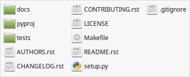
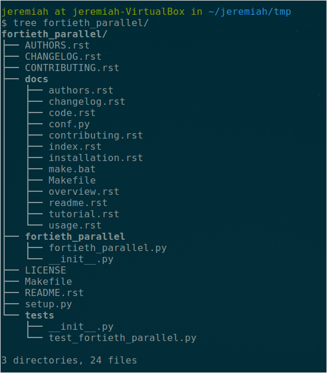
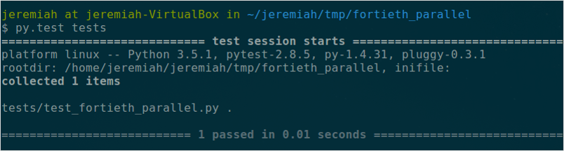
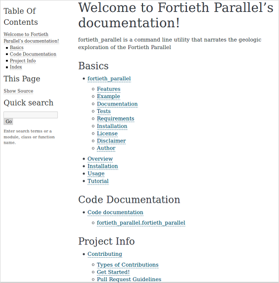
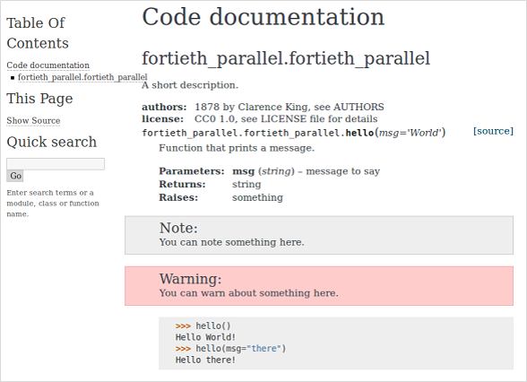

.. image:: https://upload.wikimedia.org/wikipedia/commons/thumb/1/1c/USGS_logo_green.svg/320px-USGS_logo_green.svg.png
        :target: http://www.usgs.gov/
        :alt: U.S. Geological Survey logo

cookiecutter-python-package
===========================

A simple Python_ project template for `U.S. Geological Survey (USGS)`_ software projects.  The main goal of this project
is to automatically create a clear, consistent, and structured code project setup for USGS_ software like the following:

Features
--------

* Simple, clear, consistent, and structured Python_ project template designed to meet `U.S. Geological Survey (USGS)`_ software project needs using Cookiecutter_
* Code testing setup with pytest_
* Website and code documentation setup with Sphinx_
* Formatted AUTHORS, CHANGELOG, CONTRIBUTING, and README files
* Clear LICENSE file for USGS_ software
* Automatically adds the approved or preliminary disclaimer statements for software from the `USGS Fundamental Science Practices`_
* Helpful project cleanup with an initial Makefile
* Helpful .gitignore file
* Installation ready `setup.py` file
* Free software - `CC0 1.0`_

Usage
-----
To generate a template Python_ project for USGS_ software, run the Cookiecutter_ program in a directory of your choice
with the url location of this *cookiecutter-python-package* template project::

    $ cookiecutter https://github.com/usgs/cookiecutter-python-package.git

After running the command above, you will be prompted to answer a few questions about your software project and then
your project template will be created in your current working directory.

FYI, there is an example *cookiecutter-python-package* project template called *pyproj* located in the ``examples``
directory of this repository.  The example project template also includes a initial project website located in the
``docs`` directory.  To open the website, navigate to ``example/pyproj/docs/_build/html)`` and open the ``index.html``
file in your browser.

Requirements
------------

- Python_ - version 2 or 3
- Cookiecutter_
- pytest_
- Sphinx_

You can download and install Python_ (version 2 or 3) by visiting https://www.python.org/downloads/.

Python_ ships with a package manager called pip_ that is used to install and manage Python_ software packages.
After intalling Python_, you can use pip_ from the terminal or Windows command line to install the Cookiecutter_
program. Using a terminal::

    $ pip install cookiecutter

Or, if you have Anaconda_, a free scientific Python distrubution, you can use conda_::

    $ conda install -c https://conda.binstar.org/pydanny cookiecutter

As a side note, on Windows, you can install Git_ which will provide a Unix-style terminal and a shell called Git Bash.

Please see http://cookiecutter.readthedocs.io/en/latest/installation.html for more information on installing
Cookiecutter_.

Example
-------

This example shows how `Clarence King`_, first director of the USGS_, would have created a *cookiecutter-python-package*
template project for his work as a U.S. Geologist on the `Geological Exploration of the Fortieth Parallel`_, commonly
known as the Fortieth Parallel Survey, in 1867.

In the directory where you want your software project to reside, run the cookiecutter program (Cookiecutter_)
with the url location of the *cookiecutter-python-package* template project::

    $ cookiecutter https://github.com/usgs/cookiecutter-python-package.git

Answer the following prompts where default values are specified in the brackets::

    full_name [Jeremiah Lant]: Clarence King
    email [jlant@usgs.gov]: cking@usgs.gov
    project_name [pyproj]: Fortieth Parallel
    project_slug [fortieth_parallel]: <Enter>
    project_short_description [pyproj contains all the files and directories you need to create a Python project.]: fortieth_parallel is a command line utility that narrates the geologic exploration of the Fortieth Parallel
    release_date [2016-05-14]: 1878-01-01
    year [1878]: <Enter>
    version [0.1.0]: <Enter>
    reviewed_and_approved [no]: yes

Let's take a look at the contents of the template project::

    $ tree fortieth_parallel

Let's run our initial tests::

    $ cd fortieth_parallel
    $ py.test tests

Let's make a project website and then look at it's front page::

    $ cd docs
    $ make html
    sphinx-build ...
    ...
    Build finished. The HTML pages are in _build/html.
    $ firefox _build/html/index.html

Here's what the initial code documentation page looks like on the project website

You are now ready to start coding (the fun part!) with the framework and structure of your software project already
setup. Have fun!

License
-------

This software is licensed under `CC0 1.0`_ and is in the `public domain`_ because it contains materials that originally
came from the `U.S. Geological Survey (USGS)`_, an agency of the `United States Department of Interior`_. For more
information, see the `official USGS copyright policy`_.

.. image:: http://i.creativecommons.org/p/zero/1.0/88x31.png
        :target: http://creativecommons.org/publicdomain/zero/1.0/
        :alt: Creative Commons logo

Disclaimer
----------

This software is preliminary or provisional and is subject to revision. It is being provided to meet the need for timely
best science. The software has not received final approval by the U.S. Geological Survey (USGS). No warranty, expressed
or implied, is made by the USGS or the U.S. Government as to the functionality of the software and related material nor
shall the fact of release constitute any such warranty. The software is provided on the condition that neither the USGS
nor the U.S. Government shall be held liable for any damages resulting from the authorized or unauthorized use of the
software.

The USGS provides no warranty, expressed or implied, as to the correctness of the furnished software or the suitability
for any purpose. The software has been tested, but as with any complex software, there could be undetected errors. Users
who find errors are requested to report them to the USGS.

References to non-USGS products, trade names, and (or) services are provided for information purposes only and do not
constitute endorsement or warranty, express or implied, by the USGS, U.S. Department of Interior, or U.S. Government, as
to their suitability, content, usefulness, functioning, completeness, or accuracy.

Although this program has been used by the USGS, no warranty, expressed or implied, is made by the USGS or the United
States Government as to the accuracy and functioning of the program and related program material nor shall the fact of
distribution constitute any such warranty, and no responsibility is assumed by the USGS in connection therewith.

This software is provided "AS IS."

Author
------

Jeremiah Lant (`@jlant-usgs`_)

.. _Python: https://www.python.org/
.. _Cookiecutter: http://cookiecutter.readthedocs.org/en/latest/
.. _pytest: http://pytest.org/latest/
.. _Sphinx: http://sphinx-doc.org/
.. _public domain: https://en.wikipedia.org/wiki/Public_domain
.. _CC0 1.0: http://creativecommons.org/publicdomain/zero/1.0/
.. _U.S. Geological Survey: https://www.usgs.gov/
.. _USGS: https://www.usgs.gov/
.. _U.S. Geological Survey (USGS): https://www.usgs.gov/
.. _USGS Fundamental Science Practices: https://www2.usgs.gov/fsp/fsp_disclaimers.asp
.. _United States Department of Interior: https://www.doi.gov/
.. _official USGS copyright policy: http://www.usgs.gov/visual-id/credit_usgs.html#copyright/
.. _U.S. Geological Survey (USGS) Software User Rights Notice: http://water.usgs.gov/software/help/notice/
.. _pip: https://pypi.python.org/pypi/pip
.. _Anaconda: https://www.continuum.io/downloads
.. _conda: http://conda.pydata.org/docs/
.. _Clarence King: https://en.wikipedia.org/wiki/Clarence_King
.. _Geological Exploration of the Fortieth Parallel: https://en.wikipedia.org/wiki/Geological_Exploration_of_the_Fortieth_Parallel
.. _Git: https://git-scm.com/downloads
.. _`@jlant-usgs`: https://github.com/jlant-usgs
